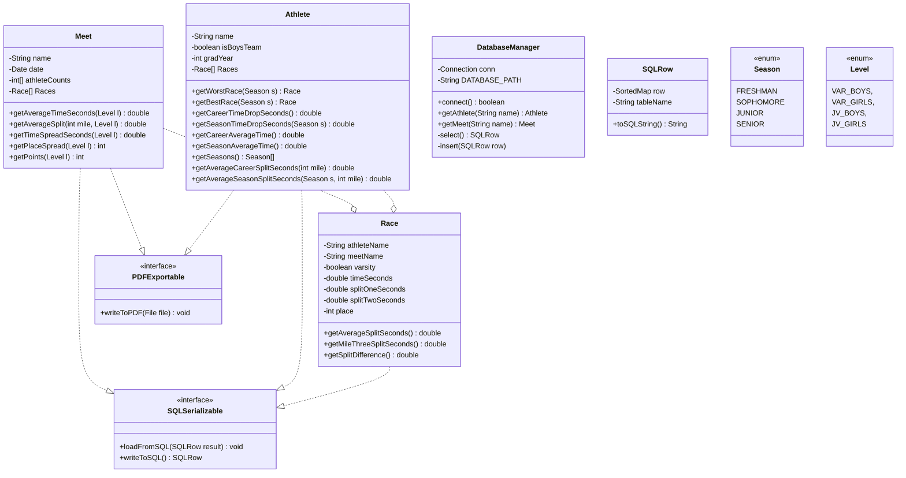

```mermaid

classDiagram

    Race..|>SQLSerializable
    Athlete..|>SQLSerializable
    Meet..|>SQLSerializable

    Athlete..|>PDFExportable
    Meet..|>PDFExportable

    Athlete..o Race
    Meet..o Race    

    
    class DatabaseManager {
        -Connection conn
        -String DATABASE_PATH

        +connect() boolean
        +getAthlete(String name) Athlete
        +getMeet(String name) Meet

        -select() SQLRow
        -insert(SQLRow row)
    }

    class PDFExportable {
        <<interface>>

        +writeToPDF(File file) void
    }

    class SQLSerializable {
        <<interface>>

        +loadFromSQL(SQLRow result) void
        +writeToSQL() SQLRow
    }

    class SQLRow {
        -SortedMap<String, String> row
        -String tableName

        +toSQLString() String
    }

    class Race {
        -String athleteName
        -String meetName
        -boolean varsity
        -double timeSeconds
        -double splitOneSeconds
        -double splitTwoSeconds
        -int place

        +getAverageSplitSeconds() double
        +getMileThreeSplitSeconds() double
        +getSplitDifference() double
    }

    class Athlete {
        -String name
        -boolean isBoysTeam
        -int gradYear
        -Race[] Races

        +getWorstRace(Season s) Race
        +getBestRace(Season s) Race
        +getCareerTimeDropSeconds() double
        +getSeasonTimeDropSeconds(Season s) double
        +getCareerAverageTime() double
        +getSeasonAverageTime() double
        +getSeasons() Season[]
        +getAverageCareerSplitSeconds(int mile) double
        +getAverageSeasonSplitSeconds(Season s, int mile) double

    }

    class Meet {
        -String name
        -Date date
        -int[] athleteCounts
        -Race[] Races

        +getAverageTimeSeconds(Level l) double
        +getAverageSplit(int mile, Level l) double
        +getTimeSpreadSeconds(Level l) double
        +getPlaceSpread(Level l) int
        +getPoints(Level l) int
    }

    class Season {
        <<enum>>
        FRESHMAN
        SOPHOMORE
        JUNIOR
        SENIOR
    }

    class Level {
        <<enum>>
        VAR_BOYS,
        VAR_GIRLS,
        JV_BOYS,
        JV_GIRLS
    }

```