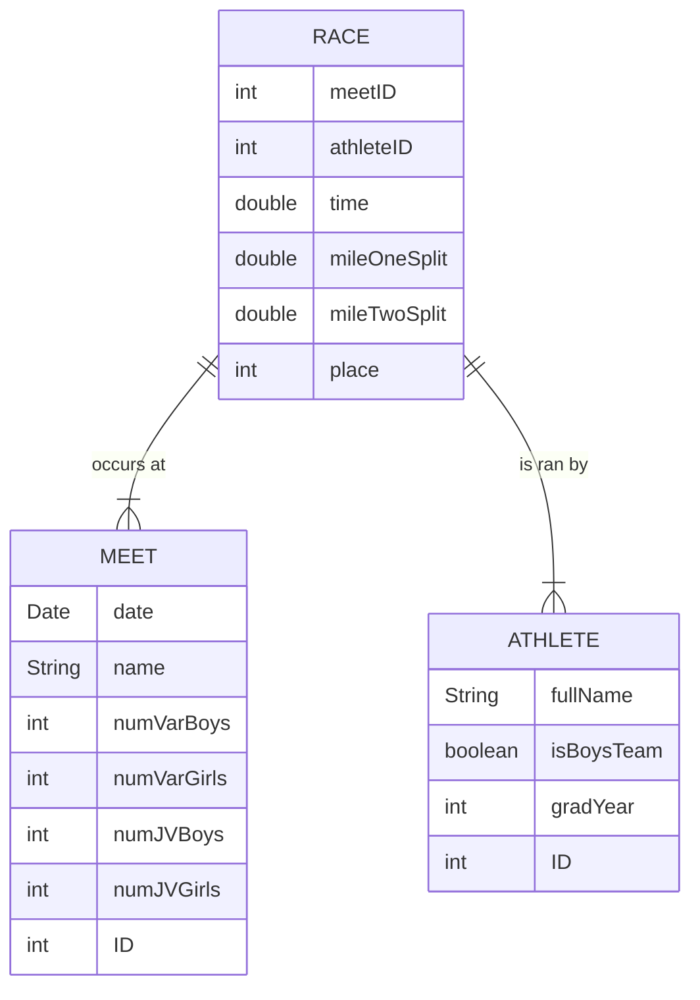

```mermaid

erDiagram
    RACE ||--|{ MEET :"occurs at"
    RACE ||--|{ ATHLETE:"is ran by"

    RACE {
        int meetID
        int athleteID
        double time
        double mileOneSplit
        double mileTwoSplit
        int place
    }

    MEET {
        Date date
        String name
        int numVarBoys
        int numVarGirls
        int numJVBoys
        int numJVGirls
        int ID
    }

    ATHLETE {
        String fullName
        boolean isBoysTeam
        int gradYear
        int ID
    }

```