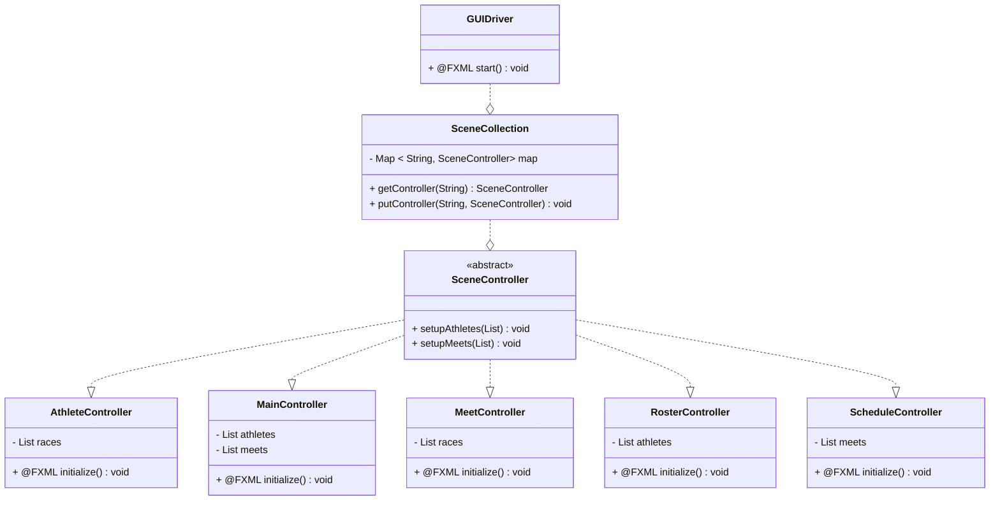

```mermaid

classDiagram

    GUIDriver ..o SceneCollection
    SceneCollection ..o SceneController


    SceneController ..|> AthleteController 
    SceneController ..|> MainController 
    SceneController ..|> MeetController 
    SceneController ..|> RosterController 
    SceneController ..|> ScheduleController

    class SceneCollection {
        - Map < String, SceneController> map 

        + getController(String) SceneController
        + putController(String, SceneController) void
    }

    class SceneController {
        <<abstract>>

        + setupAthletes(List<athlete>) void
        + setupMeets(List<meet>) void
    }

    class AthleteController {
        - List races
        + @FXML initialize() void
    }

    class MainController {
        - List athletes
        - List meets
        + @FXML initialize() void
    }

    class MeetController {
        - List races
        + @FXML initialize() void
    }

    class RosterController {
        - List athletes
        + @FXML initialize() void
    }

    class ScheduleController {
        - List meets
        + @FXML initialize() void
    }

    class GUIDriver {
        + @FXML start() void
    }

```